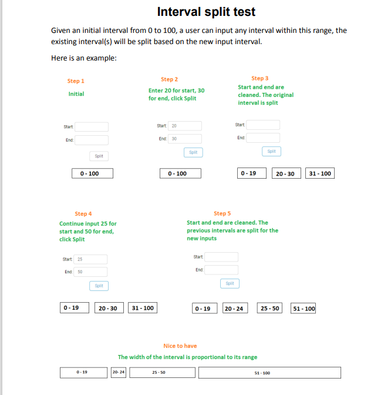

# Getting started

Read the following instructions to setup the project in your computer:

1. clone the repo or create a new codespace
2. create a branch with your first and last name
3. run `npm install`
4. run `npm start`
5. push the code when you are done

### Your task:

### Additional notes

- The interface contains 2 input fields, a split button and the result of the intervals (can be
represented by spans with range inside).
- Nice to have: set the width of the spans proportional to its range.
- You have up to 2 hours to complete this test.
- Please do not use any third party library.
- The interval split algorithm must be implemented by yourself.
- Use React documentation if needed.
